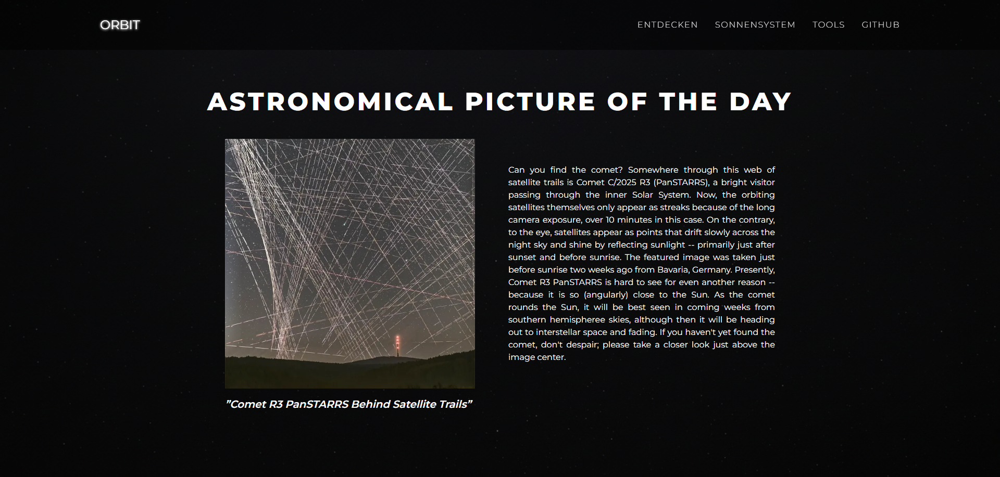
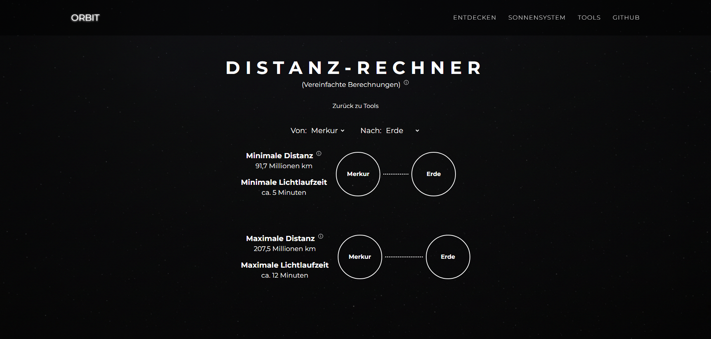
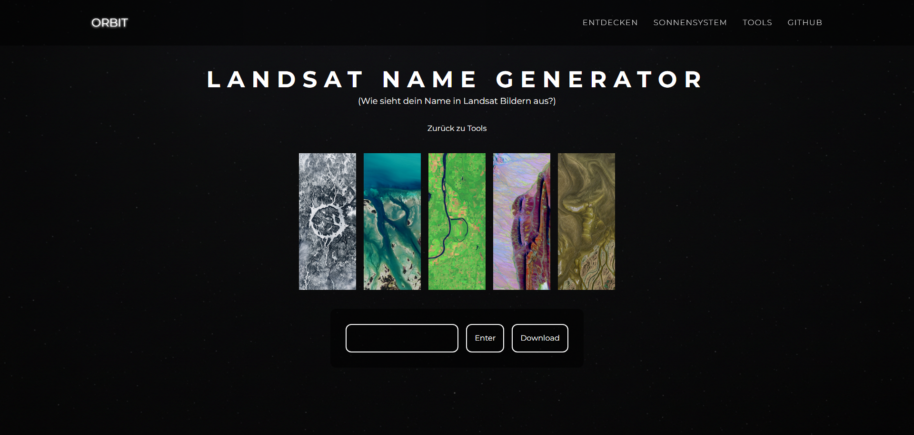

# Orbit 🪐

**Orbit** ist eine interaktive Space/Science-Webapp auf Basis von Next.js (App Router). Die App kombiniert externe NASA-Daten mit einem kuratierten Planetendatensatz und übersetzt diese in verständliche, direkt nutzbare UI-Tools.

## Live Demo

Die aktuelle Deploy-Version ist hier erreichbar: `https://orbit-two-sigma.vercel.app/`

Hinweis: Die Demo wird von **Vercel** nach einem erfolgreichen PR-Merge **zeitverzögert** aktualisiert und ist danach wieder **up to date** mit dem aktuellen Stand.

## Screenshots






## Highlights

- **Solar-System Explorer**: Detailseiten mit planetenspezifischen Kennzahlen (z. B. Tageslänge, Durchmesser, Monde) plus abgeleitete Metriken (u. a. Lichtlaufzeit).
- **Mini-Tools**:
  - **Gewicht-Rechner**: Berechnet Körpergewicht auf Basis planetarer Oberflächengravitation.
  - **Distanz-Rechner**: Schätzt Min-/Max-Distanzen zwischen Planeten (vereinfachtes Modell) inkl. Lichtlaufzeit.
  - **Größen-Rechner**: Vergleicht Volumina nach dem Prinzip "Wie oft passt X in Y?".
  - **Landsat Name Generator**: Erzeugt eine Buchstaben-Collage aus Landsat-Bildern und exportiert clientseitig als PNG.
- **Klarer Datenfluss**: Externe API-Daten (NASA APOD) und interne Referenzdaten werden sauber getrennt verarbeitet und im UI konsistent zusammengeführt.
- **Serverseitiger API-Proxy**: Eigene Route unter `/api/nasa` kapselt den NASA-Request und hält API-Details vom Client fern.

## Projektstruktur (Kurzüberblick)

- `app/page.tsx`: APOD Landing Page (ruft `/api/nasa` auf)
- `app/api/nasa/route.ts`: NASA APOD Proxy (Server Route Handler)
- `app/solar-system/page.tsx`: Solar-System Explorer UI
- `app/tools/*`: Rechner und Generatoren
- `app/data/*`: Kuratierte Datensätze (u. a. Planetenwerte, Texte und weitere Referenzdaten)

## Tech-Stack

- **Framework**: Next.js (App Router) + React
- **Sprache**: TypeScript
- **Styling**: Tailwind CSS
- **UI**: Radix UI + Phosphor Icons
- **Utilities**: `html-to-image` (PNG-Export)

## Lokal starten

### Voraussetzungen

- Node.js (aktuell) + npm
- NASA API Key für APOD

### Setup

1. Dependencies installieren:

```bash
npm ci
```

2. Environment Variable setzen (z. B. in `.env.local`):

```bash
NASA_APOD_API_KEY=dein_key_hier
```

3. Dev-Server starten:

```bash
npm run dev
```

Dann im Browser öffnen: `http://localhost:3000`
